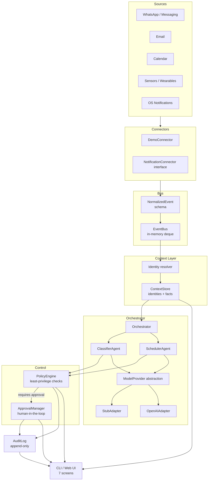

# Essence Pulse Architecture

> This document describes the technical architecture of Essence Pulse — a permission-controlled AI interoperability layer prototype.

---

## Core insight

**What is an agent-native operating system?**

An agent-native OS exposes device capabilities (notifications, sensors, calendar, messages) as a structured event stream rather than isolated app silos.  An AI orchestration layer processes these events with scoped permissions, routes them to specialist agents, and surfaces results through a unified human interface.

**What is an AI interoperability layer?**

A software layer that allows multiple AI agents — potentially from different providers — to process events, share context, and coordinate actions while operating within a user-defined permission boundary.

---

## System overview



---

## Component descriptions

### Connectors

Transform raw signals from apps, devices, or services into `NormalizedEvent` objects.

- **`DemoConnector`** — emits synthetic events for local demos (no real data).
- **`NotificationConnector`** — abstract interface for real connectors.

### Normalized Event Bus

A thread-safe in-memory `deque` that stores and broadcasts `NormalizedEvent` objects.

```python
{
    "source": "whatsapp_demo",
    "event_type": "message.received",
    "actor": "customer_123",
    "context": "sales",
    "sensitivity": "private",
    "required_permission": "read",
    "payload": { "body": "Can we meet tomorrow afternoon?" }
}
```

`payload` is always treated as untrusted input.  Agents never receive it as a system instruction.

### Context layer

- **`ContextStore`** — holds `Identity` records, key-value facts, and demo calendar data.
- All memory is inspectable and deletable by the user.
- Agents receive only a `to_agent_context()` minimal projection, not the full profile.

### AI Orchestrator

Coordinates the pipeline:
1. Resolve identity.
2. Check policy before each agent access.
3. Invoke `ClassifierAgent`.
4. If scheduling request, invoke `SchedulerAgent`.
5. Request human approval for consequential actions.
6. Record every step in `AuditLog`.

### Model provider abstraction

```python
class ModelProvider(ABC):
    def complete(self, prompt: str, *, context: dict) -> str: ...
```

Concrete adapters: `StubAdapter` (offline), `OpenAIAdapter`, and planned adapters for Claude, Gemini, and local models.

Untrusted user content is always isolated from system instructions using explicit delimiters.

### Policy engine

- Maintains a list of `Permission` grants per agent.
- `Permission` specifies `agent_id`, `resource`, `CapabilityLevel` (read / propose / execute / admin), and optional context scoping.
- `PolicyEngine.check()` returns a `PolicyDecision` before any agent accesses data.

### Approval manager

- Consequential actions (`propose`, `execute`) route through `ApprovalManager`.
- In CLI mode, prompts the user interactively.
- In web mode, accumulates pending requests for UI display.
- Sets `approved_by` field recorded in the audit log.

### Audit log

- Append-only `AuditEntry` records (frozen dataclasses).
- Captures: action, agent, event, outcome, approver, timestamp.
- No raw payload or PII is stored in the log.
- Optionally persisted to a newline-delimited JSON file.

---

## Data flow — scheduling example

```
WhatsApp message: "Can we meet tomorrow afternoon?"

1. DemoConnector.emit()
   → NormalizedEvent(source=whatsapp, actor=customer_123, payload={"body": "..."})

2. EventBus.publish(event)

3. Orchestrator.process(event)
   a. ContextStore.resolve_identity("customer_123")
      → Identity(display_name="Alex Chen", relationship="customer")
   b. PolicyEngine.check("classifier_agent", "messages", READ)  → allowed
   c. ClassifierAgent.run(event, identity_context)
      → {"event_type": "scheduling_request", "confidence": 0.94, ...}
   d. PolicyEngine.check("scheduler_agent", "calendar", READ)   → allowed
   e. ContextStore.get_calendar()  → free_slots = [...]
   f. SchedulerAgent.run(event, identity_context)
      → suggested_reply = "Hi! Tomorrow works. How about 2 PM?"
      → requires_approval = True
   g. ApprovalManager.request_approval(result)
      → [user input: y]
      → ApprovalOutcome.APPROVED
   h. AuditLog.record(action="send_message", outcome="approved", approved_by="user")

4. Result: 6 audit entries, event.processed = True
```

---

## Security architecture

See [SECURITY.md](SECURITY.md) for the full threat model.

Key design decisions:

| Decision | Rationale |
|----------|-----------|
| Agents receive only `to_agent_context()` | Prevents data minimization violations |
| User content wrapped in explicit delimiters | Mitigates prompt injection |
| `PolicyEngine` checked before every data access | Prevents confused-deputy attacks |
| `ApprovalManager` gates all non-read actions | Preserves human authority |
| `AuditLog` is append-only frozen dataclasses | Prevents log tampering |
| No `eval()` / `exec()` | Eliminates code injection surface |

---

## Extension points

| Extension | How |
|-----------|-----|
| Add a new AI provider | Subclass `ModelProvider`, implement `complete()` |
| Add a new data source | Implement `NotificationConnector` interface |
| Add a new specialist agent | Subclass `BaseAgent`, declare `required_permissions` |
| Persist audit log | Pass `persist_path` to `AuditLog()` |
| Add custom permission rules | Call `PolicyEngine.grant()` at startup |
| Web UI | Mount `essence_pulse.ui.app` (FastAPI) |

---

## What is available today vs. future

| Capability | Status |
|------------|--------|
| Event normalization | ✅ Prototype |
| In-memory event bus | ✅ Prototype |
| Identity resolution | ✅ Prototype (demo data) |
| AI classification (stub) | ✅ Prototype |
| Scheduling agent (stub) | ✅ Prototype |
| Policy engine | ✅ Prototype |
| Human approval (CLI) | ✅ Prototype |
| Audit log | ✅ Prototype |
| OpenAI adapter | ✅ Included |
| Claude / Gemini adapters | 🔜 Planned |
| Real connector (Android notifications) | 🔜 Speculative |
| Persistent memory store | 🔜 Planned |
| Web UI | 🔜 Planned |
| Multi-device sync | 🔜 Speculative |
