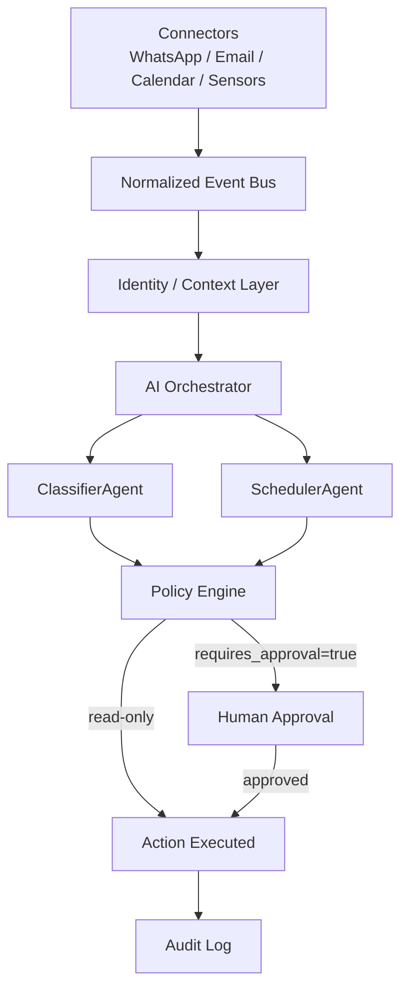

# Essence Pulse

**Permission-controlled AI interoperability layer — an independent open-source prototype.**

> «Intelligence may be distributed. Authority remains with the human.»

---

## What is this?

Today, humans navigate between dozens of disconnected apps.  Essence Pulse proposes a different architecture: a **personal intelligence layer** that understands events across apps, devices, and services — without giving any single AI unrestricted access to your digital life.

```
Today:        Human → App → App → App → App

Essence Pulse:
              Human
                ↓
          Personal AI
                ↓
         Context + Memory
                ↓
        Policy / Permission Engine
                ↓
            Event Mesh
                ↓
    Apps / Devices / Services / Robots
```

Applications become **capabilities** accessible through a controlled intelligence layer rather than isolated destinations.

---

## The problem

- Notifications arrive as interruptions, not structured events an AI can reason about.
- Personal context (your calendar, relationships, preferences) is fragmented across proprietary silos.
- No single AI vendor should have unrestricted access to your entire digital life.
- AI agents need scoped, revocable permissions — the same trust model we apply to apps.

---

## Architecture overview



Every event flows through:

| Step | Component | Principle |
|------|-----------|-----------|
| 1 | Connector | Normalize raw signal |
| 2 | Event Bus | Decouple source from consumer |
| 3 | Context Layer | Resolve identity, minimum data |
| 4 | AI Orchestrator | Route to specialist agent |
| 5 | Policy Engine | Least-privilege check |
| 6 | Human Approval | Consequential actions need consent |
| 7 | Action | Simulated execution |
| 8 | Audit Log | Immutable record |

---

## Quick start

No API key required. All data is synthetic.

```bash
git clone https://github.com/humanessencelabs/langchain
cd langchain/libs/partners/essence-pulse

pip install -e ".[dev]"

# Run the interactive demo
python demo/run_demo.py

# Auto-approve (no prompts, useful for CI)
python demo/run_demo.py --auto-approve

# Try different scenarios
python demo/run_demo.py --scenario urgent_message
python demo/run_demo.py --scenario informational
```

### What the demo shows

```
[EVENT]    message.received from customer_123
           "Can we meet tomorrow afternoon?"
[CONTEXT]  Person identified: Alex Chen (Sales contact)
[AGENT]    ClassifierAgent: scheduling_request (confidence 0.94)
[POLICY]   calendar.read ✓  messages.propose ✓
[AGENT]    SchedulerAgent: suggested reply generated
           "Hi! Tomorrow afternoon works great. How about 2 PM?"
[APPROVAL] ⚠ Action requires your approval: send_message
           > Approve? [y/N]:
[ACTION]   Response sent (simulated)
[AUDIT]    6 entries recorded
```

---

## Run tests

```bash
pytest tests/
```

---

## Why now?

- AI models are capable enough to act as personal orchestrators.
- Devices (phones, watches, earbuds, glasses) can all be interfaces to the same intelligence.
- The missing layer is not AI capability — it is **trust infrastructure**.
- Permissions, audit trails, and human approval are solved problems in security engineering; they need to be applied to AI agents.

---

## Safety principles

See [SECURITY.md](SECURITY.md) and [PRIVACY.md](PRIVACY.md) for the full policy.

- No API keys committed. See [`.env.example`](.env.example).
- All demo data is synthetic. No real personal data is ever used.
- Agents receive only the minimum context required for their task.
- Consequential actions require explicit human approval.
- Audit log is append-only; every decision is recorded.
- Memory is inspectable and deletable by the user.
- Untrusted content is never interpolated into system prompts.

---

## Roadmap

See [ROADMAP.md](ROADMAP.md).

---

## Model providers

The prototype ships with a **stub adapter** (no API key, deterministic outputs).  
Real providers can be plugged in via the `ModelProvider` abstraction:

| Provider | Adapter | Status |
|----------|---------|--------|
| Stub (offline) | `StubAdapter` | ✅ Included |
| OpenAI | `OpenAIAdapter` | ✅ Included (requires key) |
| Anthropic Claude | `ClaudeAdapter` | 🔜 Planned |
| Google Gemini | `GeminiAdapter` | 🔜 Planned |
| Local / GGUF | `LocalAdapter` | 🔜 Planned |

---

## Contributing

See [CONTRIBUTING.md](CONTRIBUTING.md).

---

## Disclaimer

Essence Pulse is an **independent experimental project**.  
It is not affiliated with, endorsed by, or associated with Nothing Technology Limited,  
Carl Pei, Google, OpenAI, Anthropic, or any other company mentioned in this documentation.

---

## License

MIT — see [LICENSE](LICENSE).
